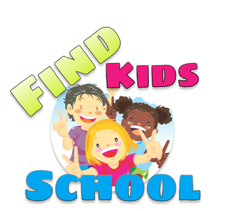
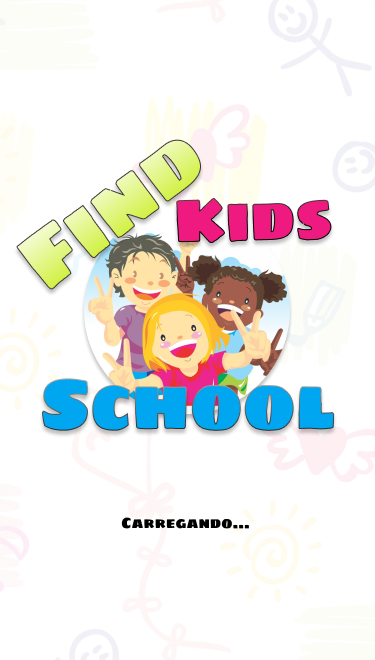
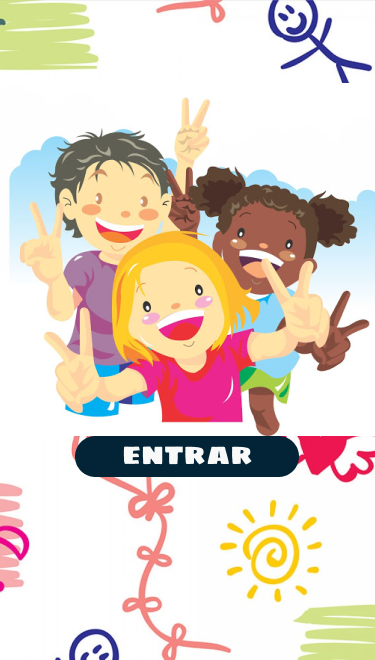
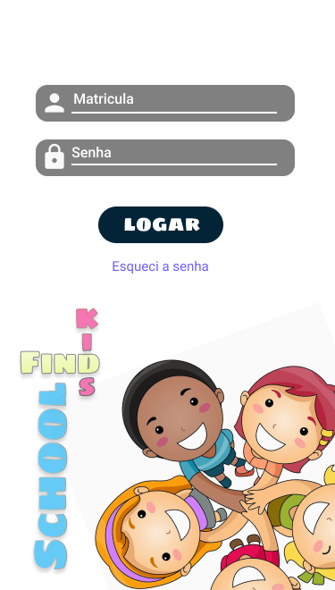
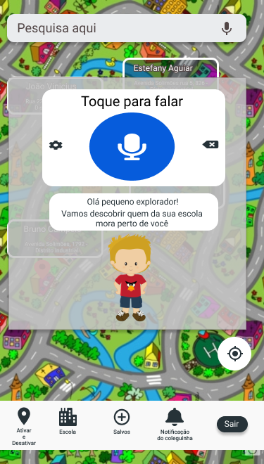
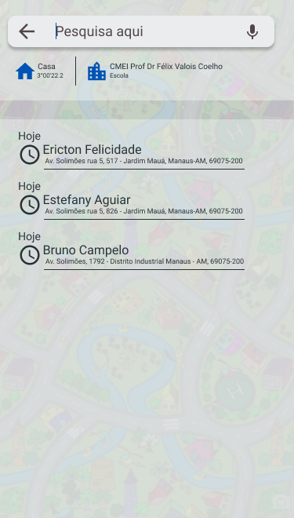
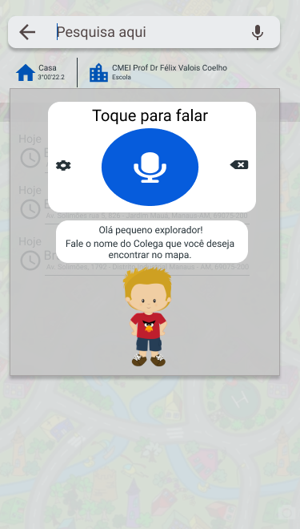

Protótipo: [FindKidsSchool](https://www.figma.com/proto/83cg1jmrsaddPPRKuYvWcC/Prot%C3%B3tipo_do_Find_kids_School?node-id=2%3A6&scaling=scale-down)

# Projeto Prático 2
> Técnicas de Design Thinking

## Índice

  1. [Sobre o Aplicativo](#sobre-o-aplicativo)

  2. [Objetivo da Aplicação](#objetivo-da-nossa-aplica%c3%a7%c3%a3o)

  3. [Perfil de Usuário](#perfil-de-usu%c3%a1rio)

  4. [Telas do Aplicativo](#telas)

  5. [Experimente nosso Protótipo](#experimente-nosso-prot%c3%b3tipo)

### Quem Somos
* Designers, em estão em busca de melhorias.

### Sobre o Aplicativo

#### Objetivo da nossa Aplicação
> Nosso objetivo é ajudar a criança encontrar os colegas da escola que estudam na mesma turma ou não, que moram na vizinhança da casa da criança.

#### Perfil de Usuário
> Nosso protótipo é voltado para crianças de 07 á 11 anos.

#### Telas
1. Tela que deve aparecer quando a Aplicação rodar.

2. Tela para entrar na aplicação.

3. Tela para efetuar o login, onde o usuário so pode logar se souber a sua matricula registrada na escola.

4. Tela do Mapa, onde mostrará ao usuário os colegas da escola que moram proximo dele.

5. Tela de Voz, onde nosso personagem conversará com o usuário.

6. Tela para pesquisar colegas.

7. Tela de Voz, onde nosso personagem perguntará o nome do colega para realizar a busca, e o usuário respondera com sua voz.

8. Tela de solicitação de visitas.

9. Tela mostrando como localizar a Escola.

10. Tela que identifica os colegas salvos.

#### Experimente nosso Protótipo
Clique no
[FindKidsSchool](https://www.figma.com/proto/83cg1jmrsaddPPRKuYvWcC/Prot%C3%B3tipo_do_Find_kids_School?node-id=2%3A6&scaling=scale-down)
